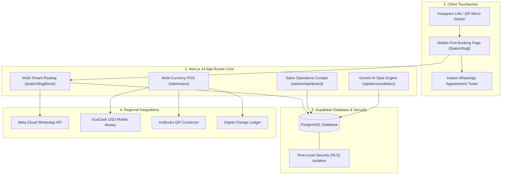

# 💈 TrimFlow AI — Enterprise Salon & Barbershop Multi-Tenant SaaS

[](https://nextjs.org/)
[](https://www.typescriptlang.org/)
[](https://tailwindcss.com/)
[](https://supabase.com/)
[](https://ai.google.dev/)
[](https://opensource.org/licenses/MIT)

> A production-grade, multi-tenant B2B Software-as-a-Service (SaaS) platform tailored for the modern grooming and beauty industry, with specialized architectural optimizations for African and emerging markets (specifically Zimbabwe and regional cash/mobile money economies).

---

## 🎯 The Commercial Problem & Innovation

Salons and barbershops in high-density urban African hubs (e.g., Harare, Bulawayo, Nairobi, Lagos) operate in high-cash, high-volume environments but suffer from 3 acute bottlenecks:

1. **The USD Small Change Shortage:** Due to dollarization without central bank coin minting, $1, $2, and $5 cash bills are extremely scarce. Customers often cannot get change, forcing shops to issue paper credit or lose sales.
2. **Double-Booking & WhatsApp Chaos:** Up to 30% of salon revenue is lost to no-shows and disorganized manual WhatsApp chats.
3. **Utility Load-Shedding Uncertainty:** Clients avoid booking during municipal power outages unless they know the shop has solar backup.

### TrimFlow's Solutions:
- **🪙 The 1-Click Digital Change Wallet:** When a customer pays $20 cash for a $15 cut, the $5 change is credited directly to their phone number. This solves the merchant's change crisis AND locks the client into returning for their next cut.
- **⚡ Live Infrastructure Badges:** Real-time **"100% Solar Backup"** and **"Borehole Ready"** indicators displayed directly on the booking page.
- **📱 WhatsApp Automated Passes:** Direct Meta Cloud API delivery of digital appointment passes, 2-hour confirmation prompts, and 14-day re-engagement reminders.
- **🤖 Multimodal Style AI:** Powered by **Gemini 1.5 Flash Vision** to analyze client jawline and hair density, generating customized barber notes.

---

## 🏗️ System Architecture



---

## 💰 SaaS Developer Monetization Model

TrimFlow is architected to generate recurring software revenue (MRR):

| Revenue Stream | Price Point | Description |
| :--- | :--- | :--- |
| **Starter Tier** | **$29 / month** | Up to 3 chairs, public booking page, Digital Change Wallet. |
| **Pro Lounge Tier** | **$49 / month** | Unlimited chairs, multi-chair floor schedule, booth rent & commission audit. |
| **Enterprise Chain** | **$89 / month** | Multi-branch organizations, custom vanity domain, Gemini AI style consultant. |
| **WhatsApp Credit Packs** | **$10 for 500 pings** | Salons purchase automated reminder packs; 50%+ software profit margin. |
| **Onboarding & Mirror QR Kit** | **$100 one-time** | Professional barber profile photography + branded laminated mirror QR codes. |

---

## 🗄️ Multi-Tenant Database Schema

The platform implements strict tenant isolation via PostgreSQL Row-Level Security (RLS). Every table references `tenant_id`:

- `tenants`: Salons / barbershops, vanity slugs, solar/borehole flags, notification credits.
- `staff`: Chair operators, compensation types (`commission`, `booth_rent`, `salary`), booth rent fee, commission rate.
- `services`: Service catalog, duration in minutes, USD price, ZiG local equivalent.
- `clients`: Customer profile, WhatsApp number, and `store_credit_change_usd` (Digital Change balance).
- `appointments`: Start/end times, chair assignment, lifecycle status (`confirmed`, `in_chair`, `completed`, `no_show`).
- `transactions`: POS ledger, payment method (`cash_usd`, `innbucks`, `ecocash_usd`, `card`, `store_credit`), staff cut vs. shop revenue.

Full SQL migration script available in [`supabase/schema.sql`](./supabase/schema.sql).

---

## 🚀 Quickstart & Local Development

### 1. Clone the repository
```bash
git clone https://github.com/your-username/salon-enterprise-ai.git
cd salon-enterprise-ai
```

### 2. Install dependencies
```bash
npm install
```

### 3. Environment Configuration
Copy the template environment file:
```bash
cp .env.example .env.local
```
*(Note: TrimFlow includes built-in in-memory fallback data so you can test all features immediately without configuring external API keys!)*

### 4. Run the development server
```bash
npm run dev
```

Visit the routes in your browser:
- **SaaS Platform Landing Page:** `http://localhost:3000`
- **Demo Barbershop Storefront:** `http://localhost:3000/legends-barbershop-avondale`
- **Interactive 3-Step Booking Flow:** `http://localhost:3000/legends-barbershop-avondale/book`
- **Salon Owner Floor Cockpit:** `http://localhost:3000/admin/dashboard`
- **Multi-Currency POS & Change Wallet:** `http://localhost:3000/admin/pos`

---

## 🛡️ License

This project is licensed under the MIT License — see the [LICENSE](LICENSE) file for details.
